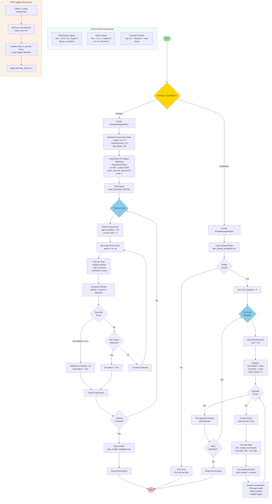

# Agent Training System Flowchart



## Key Components

### 1. **Training Pipeline** (`train.py`)
- Creates environment with 2D navigation task
- Initializes PPO agent with MLP policy
- Trains for 100,000 timesteps using experience collection and policy updates
- Saves trained model

### 2. **Environment** (`simple_navigation_env.py`)
- **State Space**: Agent's (x, y) position in [-10, 10]²
- **Action Space**: Movement vector (dx, dy) in [-1, 1]²
- **Reward**: Exponential decay based on distance to target (5, 5)
- **Episode End**: Goal reached (distance < 0.1) or max steps (100)

### 3. **Evaluation Pipeline** (`evaluate.py`)
- Loads saved model
- Runs 5 evaluation episodes with deterministic policy
- Visualizes agent's trajectory in real-time
- Reports total reward per episode

### 4. **PPO Algorithm**
- **Hyperparameters**: γ=0.99, n_steps=2048, batch_size=64, epochs=10, lr=3e-4
- Collects experiences, updates policy using clipped objective
- Logs training progress to TensorBoard
```
