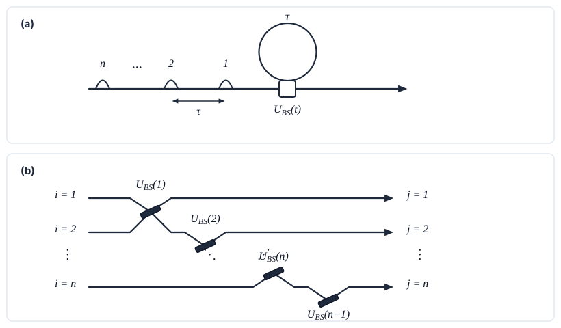

========================================================================
Circuit Architecture Guide: Static Spatial vs. Time-Domain Multiplexed
========================================================================

.. note::
   **Crucial Clarification — Paper vs. Package Scope**:
   
   The research paper (*Multi-Outcome Circuit Optimization for Enhanced Non-Gaussian State Generation*) strictly evaluates **static spatial photonic circuits** (:math:`T = 1`). Time-domain multiplexing (:math:`T > 1`) was **not** used in the paper.
   
   The ``heraldo`` Python library was built with a flexible engine capable of simulating both **static spatial circuits** (by setting ``steps = 1``) and **time-domain multiplexed circuits** (by setting ``steps > 1``). Setting ``steps = 1`` in ``heraldo`` reproduces the paper's physical model and numerical results exactly.

---

Introduction: Spatial vs. Temporal Encoding
-------------------------------------------

To understand how ``heraldo`` models quantum optical circuits, it helps to contrast two different ways of building a photonic quantum computer: **Spatial Encoding** and **Time-Bin Encoding**.

Spatial Encoding (The Paper Setup)
~~~~~~~~~~~~~~~~~~~~~~~~~~~~~~~~~~

In a conventional spatial photonic circuit:

1. **Multiple Channels**: Physical waveguides or optical fibers run parallel to each other on an optical table or chip.
2. **Simultaneous Action**: Photons enter all channels at the exact same instant (:math:`T = 1`).
3. **Physical Components**: Photons interfere through physical beam splitters and phase shifters scattered across the chip, and detectors measure ancillary modes simultaneously.

While intuitive, spatial setups require more physical hardware (more beam splitters, more waveguides, and larger chips) as the number of modes increases.

Time-Bin Encoding & Delay Loops (The TDM Concept)
~~~~~~~~~~~~~~~~~~~~~~~~~~~~~~~~~~~~~~~~~~~~~~~~~

**Time-Domain Multiplexing (TDM)** replaces spatial channels with **temporal slots**:

1. **Pulse Trains**: Instead of placing :math:`N` photons in :math:`N` separate waveguides, photons are generated as a sequence of light pulses (a *pulse train*) travelling down a **single** optical line, separated by a short time delay :math:`\tau`.
2. **Recirculating Delay Loop**: The pulse train enters a loop of optical fiber (or free-space delay) whose round-trip travel time is exactly :math:`\tau`.
3. **Temporal Interference**: The first pulse enters the loop and completes one round trip just as the second pulse arrives at the coupling beam splitter. The two pulses interfere at this **single physical beam splitter**!

By repeating this process over multiple time steps :math:`t = 1, 2, \dots, T`, a single fiber loop and a single beam splitter can simulate a large, multi-mode quantum circuit!

*Figure 1: (a) A pulse train entering a fiber loop with a dynamic beam splitter. (b) How the temporal loop interactions "unravel" into an equivalent multi-mode spatial beam splitter network (based on Motes et al., 2014).*

---

How Motes et al. (2014) Proved Loop Equivalence
-----------------------------------------------

The physical foundation of time-domain multiplexing in quantum optics was established by **Motes et al. (2014)** (*Scalable boson-sampling with time-bin encoding using a loop-based architecture*, arXiv:1403.4007).

Motes et al. proved that the temporal dynamics of a pulse train passing through a recirculating delay loop can be mathematically **"unraveled"** into an equivalent multi-stage network of spatial beam splitters:

- **Step 1**: Pulse 1 enters the loop and interacts with Pulse 2 at time :math:`t = \tau`.
- **Step 2**: The combined state circulates and interacts with Pulse 3 at time :math:`t = 2\tau`.
- **Step :math:`T`**: The recirculating state interacts with Pulse :math:`T+1` at time :math:`t = T\tau`.

This means you do **not** need to build hundreds of physical beam splitters on a giant chip. A single, well-controlled fiber loop reused over :math:`T` temporal steps can synthesize complex multi-mode quantum states with :math:`O(1)` physical hardware complexity!

---

How ``heraldo`` Models Time-Domain Multiplexing
-----------------------------------------------

In ``heraldo``, time-domain circuits are defined via the ``TimeMultiplexedCircuit`` interface. Modes are divided into two distinct operational roles:

1. **Mode 0 (Loop Memory Mode)**:
   This is the persistent quantum state circulating in the delay loop. It carries the evolving state vector :math:`|\psi_t\rangle` sequentially from step :math:`t-1` to step :math:`t`. **Mode 0 is never discarded or reset.**

2. **Modes :math:`1, \dots, N-1` (Ancilla Pulse Modes)**:
   These represent fresh incoming temporal pulses prepared at each step :math:`t`. They enter the loop coupling stage, interfere with Mode 0, and are then measured using Photon-Number-Resolving (PNR) detectors.

Step-by-Step Evolution
~~~~~~~~~~~~~~~~~~~~~~

At each time step :math:`t = 1, \dots, T`:

1. **Input**: Mode 0 arrives carrying the conditional state from the previous step, :math:`|\psi_{t-1}\rangle`.
2. **Preparation**: Ancilla modes :math:`1, \dots, N-1` are initialized in vacuum and prepared with step-dependent squeezing :math:`S_i(t)` and displacement :math:`D_i(t)`.
3. **Interference**: Step unitary :math:`U_t` (beam splitter network) mixes Mode 0 with the ancillae.
4. **Measurement**: Ancilla modes are measured with PNR detectors, yielding photon counts :math:`\mathbf{n}_t = (n_1(t), \dots, n_{N-1}(t))`.
5. **State Update**: Conditioned on detecting pattern :math:`\mathbf{n}_t`, the new state projected onto Mode 0 is normalized:

   .. math::
      |\psi_t\rangle = \frac{\langle \mathbf{n}_t | U_t \left( |\psi_{t-1}\rangle \otimes |\phi_{\text{ancilla}}(t)\rangle \right)}{\| \langle \mathbf{n}_t | U_t \left( |\psi_{t-1}\rangle \otimes |\phi_{\text{ancilla}}(t)\rangle \right) \|}

6. **Recirculation**: Mode 0 circulates through the loop to become the input state for step :math:`t+1`.

---

Connecting the Paper Setup to the Package (Setting ``steps = 1``)
-----------------------------------------------------------------

Because the research paper focused on **static spatial circuits**, we evaluated single-stage interactions (:math:`T = 1`).

To reproduce the paper's results in ``heraldo``, simply set ``steps = 1``:

- ``TwoModeTimeDomainGeneral(steps=1)`` :math:`\longrightarrow` 2-mode static spatial circuit (1 signal mode + 1 ancilla mode).
- ``ThreeModeTimeDomainGeneral(steps=1)`` :math:`\longrightarrow` 3-mode static spatial circuit (1 signal mode + 2 ancilla modes).

When ``steps = 1``, Mode 0 represents the paper's single unmeasured signal mode, and Modes :math:`1, \dots, N-1` represent the measured ancillary spatial modes.

.. image:: _static/circuit_comparison.svg
   :align: center
   :alt: Diagram comparing Static Spatial (Paper) and Time-Domain Multiplexed (Package) Architectures
   :width: 100%

*Figure 2: Architectural comparison between (a) the static spatial circuit used in the paper (:math:`T=1`) and (b) the multi-step time-domain multiplexed circuit framework supported by heraldo (:math:`T \ge 1`).*

---

Summary Comparison Table
------------------------

.. list-table::
   :widths: 22 38 40
   :header-rows: 1

   * - Feature
     - Research Paper Model
     - ``heraldo`` Package Framework
   * - **Scope Evaluated**
     - Static spatial circuits (:math:`T = 1`)
     - Both static (:math:`T = 1`) and multi-step TDM (:math:`T \ge 1`)
   * - **Physical Encoding**
     - Parallel spatial channels (waveguides/fibers)
     - Time-bin pulse trains in optical delay loops
   * - **Hardware Scaling**
     - Requires :math:`O(N^2)` spatial beam splitters
     - Reuses :math:`1` delay loop over time (:math:`O(1)` spatial footprint)
   * - **Mode Persistence**
     - :math:`N` parallel spatial modes
     - Mode 0 persists across steps; Ancilla modes reset each step
   * - **How to Run**
     - Set ``steps = 1`` in ``heraldo``
     - Set ``steps = 1`` for static, or ``steps > 1`` for TDM

---

Code Examples
-------------

1. Reproducing the Paper's Static Setup (``steps = 1``)
~~~~~~~~~~~~~~~~~~~~~~~~~~~~~~~~~~~~~~~~~~~~~~~~~~~~~~~~

To run a static 3-mode circuit matching the paper:

.. code-block:: python

   from heraldo.components.circuits import ThreeModeTimeDomainGeneral
   from heraldo.components.runner import BasinHoppingRunner
   from heraldo.components.targets import CoreGKPTarget

   def main():
       # 1. Initialize static 3-mode circuit (steps=1 matches the paper)
       circuit = ThreeModeTimeDomainGeneral(
           steps=1,                 # steps=1 isolates a single static interaction stage
           time_invariant=True,
           clip_size=2.0,
           measure_fock_cutoff=10
       )

       # 2. Define target (e.g. GKP core logical 1 state)
       target = CoreGKPTarget(n_max=4, delta_db=10.0, mu=1)

       # 3. Optimize parameters using Basin-Hopping with Beam Search
       runner = BasinHoppingRunner(
           circuit=circuit,
           target_gens=[target],
           cutoff_dim=30,
           beam_width=100
       )

       result = runner.run(n_iter=20, method="L-BFGS-B")
       print(f"Paper static circuit loss: {result['loss']}")

   if __name__ == "__main__":
       main()

2. Extending to Multi-Step Time-Domain Multiplexing (``steps > 1``)
~~~~~~~~~~~~~~~~~~~~~~~~~~~~~~~~~~~~~~~~~~~~~~~~~~~~~~~~~~~~~~~~~~~~

To explore multi-step temporal state engineering beyond the scope of the paper:

.. code-block:: python

   from heraldo.components.circuits import ThreeModeTimeDomainGeneral
   from heraldo.components.runner import BasinHoppingRunner
   from heraldo.components.targets import CoreGKPTarget

   def main():
       target = CoreGKPTarget(n_max=4, delta_db=10.0, mu=1)

       # 4-step time-domain multiplexed loop circuit
       tdm_circuit = ThreeModeTimeDomainGeneral(
           steps=4,                 # 4 recirculating steps in time
           time_invariant=False,    # Dynamic, step-dependent control parameters
           clip_size=2.0,
           measure_fock_cutoff=10
       )

       runner_tdm = BasinHoppingRunner(
           circuit=tdm_circuit,
           target_gens=[target],
           cutoff_dim=30,
           beam_width=100
       )

       result_tdm = runner_tdm.run(n_iter=20, method="L-BFGS-B")
       print(f"Multi-step TDM circuit loss: {result_tdm['loss']}")

   if __name__ == "__main__":
       main()
