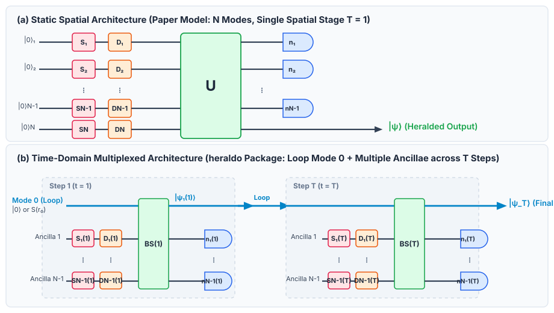

====================================
Heraldo Documentation
====================================

|

**Heraldo** is an optical quantum state engineering and optimization framework for continuous-variable (CV) photonic quantum circuits. It combines custom JIT-compiled Fock simulation backends with multi-outcome optimization algorithms to turn "waste" photon-number measurement outcomes into useful non-Gaussian quantum states.

``heraldo`` is the official open-source software implementation accompanying the paper:

   *Multi-Outcome Circuit Optimization for Enhanced Non-Gaussian State Generation* (S. Ismailzadeh & B. Abedi Ravan, 2026)

``heraldo`` is released under the MIT License — see ``LICENSE`` in the repository root for the full text.

.. note::
   **New to Heraldo?** Start with the :doc:`introduction` for core concepts and the :doc:`quickstart_tutorial` for a step-by-step hands-on guide to running your first optimization!

Key Features
============

* **Multi-Outcome Optimization Framework**:
  * **Resource Multiplexing**: Tune a single physical circuit to herald a portfolio of distinct target states across different PNR measurement patterns.
  * **Single-Target Probability Harvesting**: Aggregate multiple degenerate measurement outcomes to drastically boost the generation rate of a single target state.
* **Rotation-Invariant Optimization**: Uses an FFT-accelerated metric to evaluate state fidelity across phase-space rotations :math:`\hat{R}(\phi)`, avoiding unnecessary orientation constraints during global parameter search.
* **Supported Non-Gaussian Resource Families**: Built-in support for Gottesman-Kitaev-Preskill (GKP) core states, Schrödinger cat states, binomial quantum codes, and cubic phase states.
* **Flexible Architecture Engine**: Supports both static spatial circuits (``steps = 1``) and time-domain multiplexed (TDM) architectures (``steps > 1``); see :doc:`circuits_comparison` for details.
* **High-Performance Backend & Patches**: Automatic Strawberry Fields patches featuring an :math:`O(D^3)` JIT-compiled beam splitter, memory-leak-free uncached gate evaluation, and pure-state preservation for TDM loops, enabling fast, low-memory simulations at high cutoff dimensions (:math:`D = 30`) on standard laptop hardware; see :doc:`sf_patches` for details.

Quick Example
=============

.. code-block:: python

   import numpy as np
   from heraldo.components.circuits import TwoModeTimeDomainSqueezeOnly
   from heraldo.components.targets import SqueezedCatTarget
   from heraldo.components.runner import BasinHoppingRunner, fixed_pattern_capped_loss_fn
   from heraldo.utils import db_to_r

   def main():
       # 1. Initialize 2-mode spatial circuit with 12 dB squeezing
       circuit = TwoModeTimeDomainSqueezeOnly(steps=1, clip_size=db_to_r(12.0), measure_fock_cutoff=30)

       # 2. Define targets: Even (|cat_+>) and Odd (|cat_->) Schrödinger cat states
       targets = [
           SqueezedCatTarget(alpha=np.sqrt(6), r=0.5, p=0),
           SqueezedCatTarget(alpha=np.sqrt(6), r=0.5, p=1),
       ]
       # 3. Optimize for fixed patterns n=4 (even) and n=5 (odd)
       runner = BasinHoppingRunner(
           circuit=circuit,
           target_gens=targets,
           cutoff_dim=30,
           measurement_patterns=[[(4,)], [(5,)]],
           loss_fn=fixed_pattern_capped_loss_fn
       )

       result = runner.run(n_iter=20)
       print(f"Total Success Probability: {result['total_probability']:.2%}")

   if __name__ == "__main__":
       main()

Documentation Contents
======================

.. toctree::
   :maxdepth: 2
   :caption: Getting Started & Onboarding

   introduction
   quickstart_tutorial
   user_guide

.. toctree::
   :maxdepth: 2
   :caption: Architecture & Theory

   circuits_comparison
   sf_patches

.. toctree::
   :maxdepth: 2
   :caption: API Reference

   modules

=======
Citing This Work
================

If you use ``heraldo`` in published research, please cite the paper it
implements:

.. code-block:: bibtex

   @article{ismailzadeh_multioutcome,
     title = {Multi-Outcome Circuit Optimization for Enhanced Non-Gaussian State Generation},
     author = {Ismailzadeh, S. and Abedi Ravan, B.},
     journal = {<FILL IN — journal / arXiv identifier once assigned>},
     year = {<FILL IN>},
   }

and, if you'd also like to credit the software specifically:

.. code-block:: bibtex

   @software{heraldo_software,
     title = {heraldo: Multi-Outcome Circuit Optimization Framework},
     author = {Ismailzadeh, Sadeq},
     year = {2025},
     url = {<FILL IN — repository URL>},
     note = {<FILL IN — version / DOI, e.g. from a Zenodo release>},
   }

Both entries have placeholder fields (journal/arXiv ID, DOI) — fill these
in once the paper and/or a tagged software release have a permanent
identifier.

Building These Docs Locally
============================

.. code-block:: bash

   python build_docs.py

This installs ``docs/requirements.txt``, regenerates the API ``.rst``
files via ``sphinx-apidoc``, builds HTML into ``docs/_build/html/``, and
opens it in your browser. Windows users can equivalently double-click
``build_docs_windows.bat``.

Indices and Tables
==================
==================

* :ref:`genindex`
* :ref:`modindex`
* :ref:`search`
